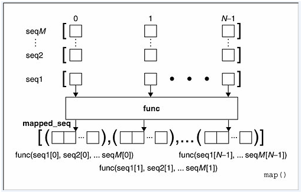

# Map, Filter 和 Reduce 函数
这三个函数会简化编程中的某些函数方法。下面我们逐一对其做介绍。python3 环境下运行，python2 环境下这些函数会有一些不同。

## 1. Map

```python
map(function, iterable, ...)
```
返回一个迭代器，它将 ```function``` 应用在 ```iterable``` 这一可迭代参数的每一个元素上，逐个返回（yeild）结果（参考1.1节）。如果传入多个 ```iterable``` 参数，则要求 ```function``` 能接受同等数量的参数，这种情况下，```function``` 会被并行地应用于所有可迭代对象的每一个元素。对于多个可迭代变量，```map``` 函数产生的迭代器会在穷尽最短的可迭代对象后停止（参考1.2节）。对于那些函数输入已经被整理成参数元组（argument tuple）的情况，请参考 ```itertools.starmap()```

### 1.1. 单一 ```iterable``` 参数
考虑一个最简单的任务，为列表 ```items``` 中的每一个元素求它的平方值，使用for循环的代码如下

```python
items = [1, 2, 3, 4, 5]
squared = []
for i in items:
    squared.append(i**2)
print(squared)
```

```
输出：[1, 4, 9, 16, 25]
```

同样的任务我们可以使用 map 来计算

```python
items = [1, 2, 3, 4, 5]
squared = map(lambda x: x**2, items)
print(squared)
```

```
输出：<map object at 0x10a383278>
```


这里使用了匿名函数来当传入的 ```function``` 参数。可以看到最后的结果 ```square``` 并不是一个列表（list），而是一个 ```map``` 对象，也就是一个迭代器，每调用一次这个迭代器的 .\_\_next\_\_() 方法都会按次序生成对应的结果。

```python
items = [1, 2, 3, 4, 5]
squared = map(lambda x: x**2, items)

a=squared.__next__()
b=squared.__next__()
c=squared.__next__()
print(a,b,c)
```

```
输出：1 4 9
```

可以看到虽然变量 ```a b c``` 都是调用的同样的函数，但是结果却不同，这有点类似c语言的指针结构，第一次调用.\_\_next\_\_() 方法返回 1 对应的结果后，下一次调用.\_\_next\_\_() 方法就会返回 2 对应的结果，以此类推。

当然我们有更简单的方法来访问这个迭代器中的内容，可以用 ```for``` 循环依次访问或者直接将其转成列表。

```python
items = [1, 2, 3, 4, 5]

print('for 循环:')
squared = map(lambda x: x**2, items)
result=[]
for i in squared:
    result.append(i)
print(result)

print('转化成列表')
squared = map(lambda x: x**2, items)
print(list(squared))
```
```
输出：
for 循环:
[1, 4, 9, 16, 25]
转化成列表
[1, 4, 9, 16, 25]
```

如果我们稍微改写一下上面的代码，注释掉倒数第二行，结果会有一点小问题

```python
items = [1, 2, 3, 4, 5]

print('for 循环:')
squared = map(lambda x: x**2, items)
result=[]
for i in squared:
    result.append(i)
print(result)

print('转化成列表')
# squared = map(lambda x: x**2, items)
print(list(squared))
```

```
for 循环:
[1, 4, 9, 16, 25]
转化成列表
[]
```

可以看到，第二个没有输出对应的数值。这是因为实际上对 ```suqared``` 的 ```for``` 循环也在内在地调用 .\_\_next\_\_() 方法，直到穷尽所有的元素。因此当在最后一行将 ```suqared``` 列表化的时候会得到一个空列表

```python
squared.__next__()
```

```python
输出：
---------------------------------------------------------------------------
StopIteration                             Traceback (most recent call last)
<ipython-input-38-1371fd72abe3> in <module>()
----> 1 squared.__next__()

StopIteration:
```

再次调用 ```suqared``` 的 .\_\_next\_\_() 方法时，会报迭代停止的错误。

### 1.2. 多个 ```iterable``` 参数

当为 ```map``` 函数传入多个 ```iterable``` 参数的时候，```map``` 会并行地处理这些参数。这里引用一张 [Pythoner](http://www.pythoner.com/46.html) 的图片。

图片中，```map``` 函数接受了 ```M``` 个 ```seq``` 的输入和一个 ```func```  函数的输入，在执行的每一步中，map 会分别将 ```M``` 个 ```seq``` 相同位置的元素传给 ```func``` 计算结果。也就是说，第一个结果会是 ```func(seq1[0],seq1[0],...,seqM[0])``` ，第二个结果会是 ```func(seq1[1],seq1[1],...,seqM[1])```。如下面这个例子，计算两个和三个列表对应元素的乘积。

```python
print(list(map(lambda x , y : x * y, [1,2,3], [2,4,6])))
print(list(map(lambda x , y , z : x * y *z, [1,2,3], [2,4,6],[1,10,100])))
```

```
输出：
[2, 8, 18]
[2, 80, 1800]
```

对于传入的可迭代对象长度不一致的情况，```map``` 会生成和之中最短序列等长的迭代器

```python
print(list(map(lambda x , y : x * y, [1,2,3], [2,4,6,8,10])))
```

```
输出：
[2, 8, 18]
```

### 1.3 使用 ```map``` 进行格式转换
如果将 ```map``` 中的 ```function``` 参数换成 python 内置的某些函数，还可以完成格式转换。

```python
print(list(map(int, [1.9,2.2,3.1])))
print(list(map(str, [1,2,3,4])))
```

```
输出：
[1, 2, 3]
['1', '2', '3', '4']
```

### 1.4. 总结
简而言之 ```map``` 将一个函数应用在一个或多个输入列表中的所有元素上


## 2. Reduce
```reduce``` 和 ```map``` 不同被放在了 ```functools``` 中：

```python
functools.reduce(function, iterable[, initializer])
```
```reduce``` 累积地将函数 ```function``` 从左至右地应用到序列 ```iterable``` 中的每一个元素，因此它将一个序列缩减到单一值。比如，```reduce(lambda x, y: x+y, [1, 2, 3, 4, 5])``` 将会计算 ```((((1+2)+3)+4)+5)```。左侧的参数 ```x``` 是前一步的累加值，右侧的参数 ```y``` 是从序列 ```iterable``` 中获取到的更新值。如果提供了可选参数 ```initializer```，将会将其放在所有 ```iterable``` 序列元素之前，作为函数  ```function``` 的初始值。如果没有提供 ```initializer``` 参数，且 ```iterable``` 中只有一个元素，那么 ```map``` 函数将会返回这个元素。

```python
from functools import reduce
print(reduce(lambda x, y: x+y, [1, 2, 3, 4, 5]))
# 提供 initializer 参数
print(reduce(lambda x, y: x+y, [1, 2, 3, 4, 5],6))
# iterable 中只有一个参数
print(reduce(lambda x, y: x+y, [1]))
```
```
输出：
15
21
1
```

## 3. filter
```python
filter(function, iterable)
```

```iterable``` 中的每个元素都会基于 ```function``` 函数判断，返回真值的元素被留下，以此来构建一个迭代器。如果 ```function``` 是 ```None``` 的话，会默认使用恒等函数（identity function），这种情况下 ```iterable``` 中所有假值被移除。

当 ```function``` 不是 ```None``` 的情况下，```filter(function, iterable)``` 等价于生成器表达式 ```(item for item in iterable if function(item))```；当 ```function``` 是 ```None``` 的情况下，等价于 ```(item for item in iterable if item)```

```python
l1 = [ 1, 2, 3, 42, 67, 16 ]  
print(list(filter(lambda x:x>10, l1)))

# function 为 None
l1 = [ 1, 2, 3, 42, 67, 16 ]  
print(list(filter(None, l1)))
l1 = [ False, 2, 0, 42, None, 16 ]  
print(list(filter(None, l1)))
```

```
输出：
[42, 67, 16]
[1, 2, 3, 42, 67, 16]
[2, 42, 16]
```

## 4. 运行时间对比
### 4.1. Map

```python
from time import time
# 计算两个列表对应元素相加
N=10001
l1=list(range(N))
l2=list(range(N,0,-1))

'''=================== Map ======================'''
tic=time()
for i in range(100):
    result_1=list(map(lambda x,y:x+y , l1,l2))
toc=time()
print('map 函数运行时间：{0:6f}'.format(toc-tic))

'''=================== For ======================'''
tic=time()
for i in range(100):
    result_2=[]
    for i in range(len(l1)):
        result_2=l1[i]+l2[i]
toc=time()
print('for 循环运行时间：{0:6f}'.format(toc-tic))

'''============= Generator expression ============='''
tic=time()
for i in range(100):
    result_3=[l1[i]+l2[i] for i in range(len(l1))]
toc=time()
print('生成器表达式运行时间：{0:6f}'.format(toc-tic))
```

```
输出
map 函数运行时间：0.114034
for 循环运行时间：0.180772
生成器表达式运行时间：0.148164
```

可以看到 ```map``` 的速度是最快的，生成器表达式要快于 ```for``` 循环。

### 4.2. Reduce

```python
# 计算前N项和
N=1001
l=list(range(N))

'''=================== Reduce ====================='''
tic=time()
for i in range(10000):
    result_1=0
    result_1=reduce(lambda x, y: x + y, l)
toc=time()
print('reduce 函数运行时间：{0:6f}'.format(toc-tic))
print('reduce 结果为：{0}'.format(result_1))

'''=================== For ========================'''
tic=time()
for i in range(10000):
    result_2=0
    for j in range(len(l)):
        result_2+=l[j]
toc=time()
print('for 循环运行时间：{0:6f}'.format(toc-tic))
print('for 结果为：{0}'.format(result_2))

'''=================== Sum ========================'''
tic=time()
for i in range(10000):
    result_3=0
    result_3=sum(l)
toc=time()
print('sum 运行时间：{0:6f}'.format(toc-tic))
print('sum 结果为：{0}'.format(result_3))
```

```
输出：
map 函数运行时间：1.080768
map 结果为：500500
for 循环运行时间：1.416803
for 结果为：500500
sum 运行时间：0.067965
sum 结果为：500500
```
可以看出 reduce 的速度比 for 循环要快，但是还是远远慢于 sum 函数，估计 sum 函数是经过特殊优化的。

```python
# 判断大小
N=1001
l=list(range(N))

'''=================== Filter ====================='''
tic=time()
for i in range(10000):
    result_1=filter(lambda x: x > N/2, l)
toc=time()
print('filter 函数运行时间：{0:6f}'.format(toc-tic))

'''=================== Generator expression ====================='''
tic=time()
for i in range(10000):
    result_2=[x for x in l if  x > N/2]
toc=time()
print('生成器表达式 函数运行时间：{0:6f}'.format(toc-tic))
```

```
输出：
filter 函数运行时间：0.004539
生成器表达式 函数运行时间：0.878352
```
差距很明显了

## 5. 函数 ```function``` 的自定义
我们不仅可以使用匿名函数定义 ```function```，还可以自己写一个函数当作参数传入。


```python
#将小写转成大写
def l_to_u (s):
    return s.upper()
print (list(map(l_to_u,'asdfd')))
```

```
输出：
['A', 'S', 'D', 'F', 'D']
```
## 6. 参考资料
https://docs.python.org/3/library/functions.html#map

http://book.pythontips.com/en/latest/map_filter.html

http://www.pythoner.com/46.html
